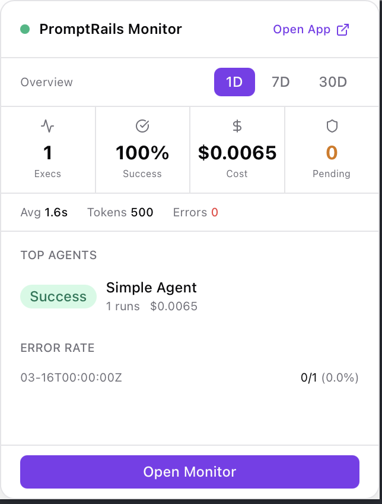
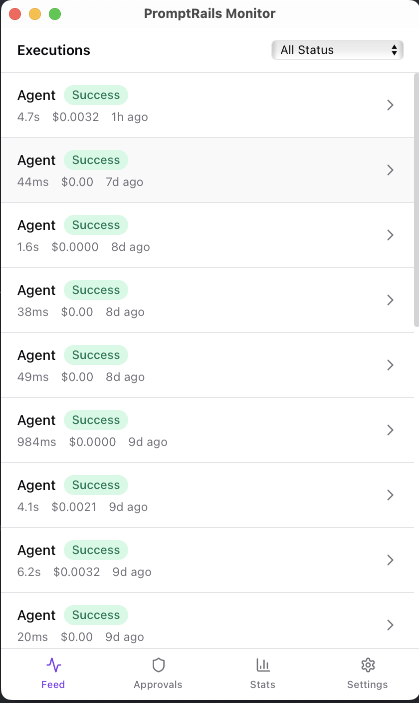
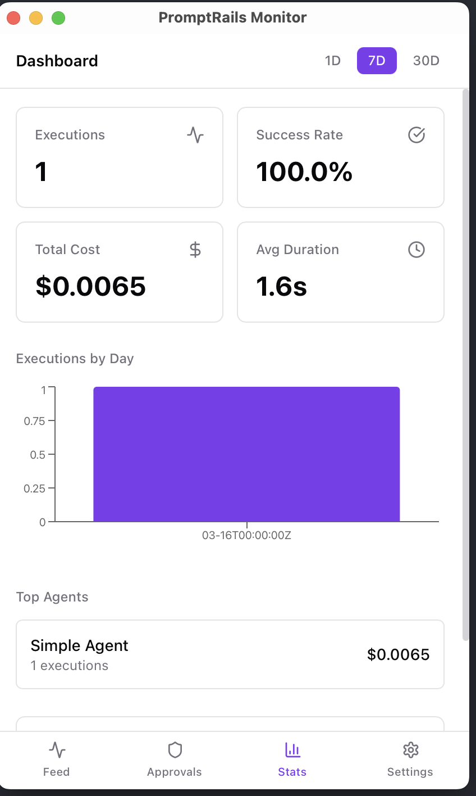
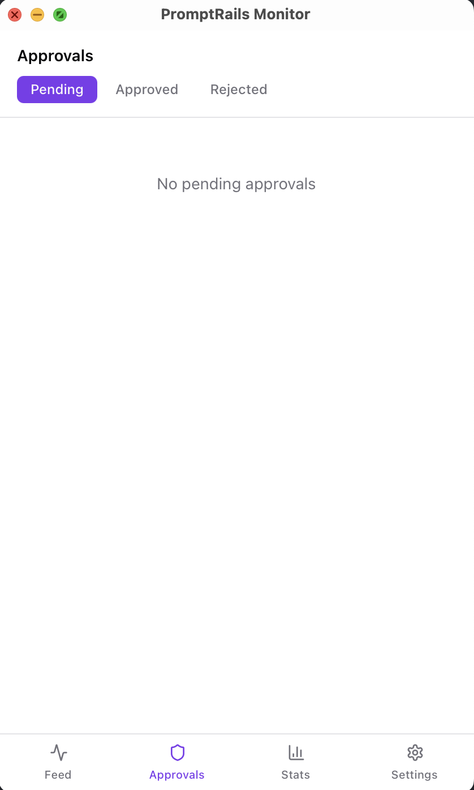
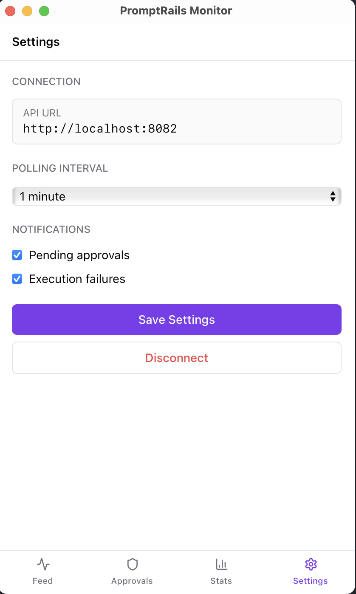

# PromptRails Monitor

Desktop monitoring app for PromptRails AI agent executions.

## Features

- **Live Execution Feed** — Real-time polling of agent executions with status, duration, and cost
- **Trace Viewer** — Collapsible trace tree with span details, input/output, and token usage
- **Approval Inbox** — Review executions parked at `waiting_approval` and approve or deny them (execution-scoped HITL)
- **Execution Tree** — Drill into sub-agent, handoff, and workflow-node runs; cancel a running execution
- **Native Notifications** — Get notified on new approvals and execution failures (configurable)
- **System Tray** — Quick overview panel on left-click, context menu on right-click
- **Trace Stats** — Trace counts, success rates, cost, tokens, models, and sessions with 1D/7D/30D period tabs
- **Infinite Scroll** — Load more executions and approvals as you scroll
- **Compact UI** — 420x700 window, no browser tab needed

## Screenshots

| Tray Panel | Execution Feed | Stats Dashboard |
|:---:|:---:|:---:|
|  |  |  |

| Approvals | Settings |
|:---:|:---:|
|  |  |

## Installation

### Homebrew (macOS)

```bash
brew install --cask promptrails/tap/promptrails-monitor
```

### Direct Download

Download the latest release from [GitHub Releases](https://github.com/promptrails/desktop/releases):

| Platform | Format |
|----------|--------|
| macOS (Apple Silicon) | `.dmg` |
| macOS (Intel) | `.dmg` |
| Windows | `.msi` / `.exe` |
| Linux | `.AppImage` / `.deb` |

See [docs/](docs/) for configuration, development, and build-from-source guides.

## SDK dependency (temporary)

This app targets PromptRails **API v2** via `@promptrails/sdk` v0.9.0, which is
not yet published to npm. Until the coordinated SDK release, `package.json`
points at the sibling checkout:

```json
"@promptrails/sdk": "file:../javascript-sdk"
```

Build the SDK before installing:

```bash
cd ../javascript-sdk && npm ci && npm run build
```

**TODO:** repin `@promptrails/sdk` to the published npm version at the
coordinated v2 release.

## License

MIT
